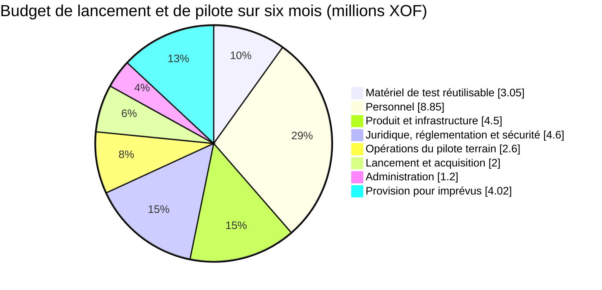
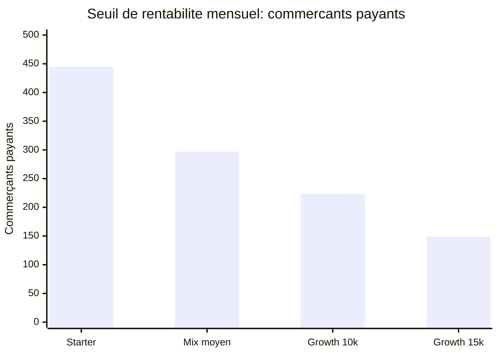
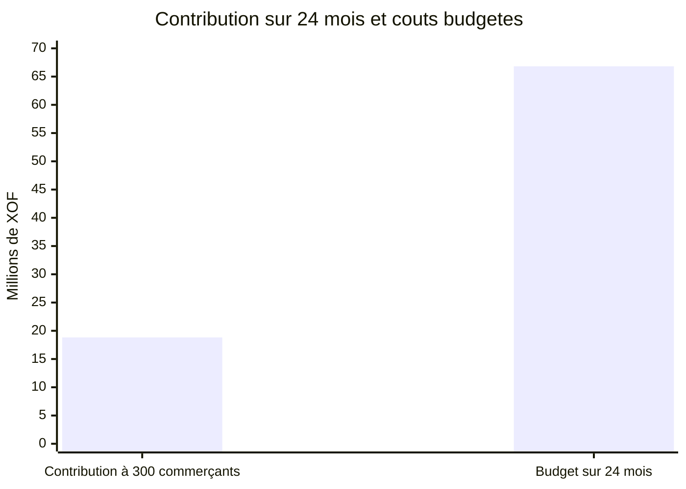

# Fidelia — Budget de lancement et de pilote (projet)

*Document de travail · 1er octobre 2026 · Côte d'Ivoire · XOF · [Version anglaise](FINANCE-BUDGET.md)*

Les équivalents en euros sont calculés au taux fixe de **1 € = 655,957 XOF** et arrondis à deux décimales. Le XOF reste la devise de référence pour l'exploitation et les contrats ; les montants en euros sont fournis à titre comparatif.

## Synthèse

Ce budget couvre un **lancement et un pilote de six mois** dans un corridor d'Abidjan, auprès de **5 à 10 commerçants**. Il prévoit environ deux mois pour la découverte, la conformité, la mise en place des partenariats et la préparation à la production, puis quatre mois d'opérations sur le terrain. Cette durée permet d'observer au moins 60 jours d'utilisation réelle. **Le pilote est gratuit pour tous les commerçants** ([CONCEPT.md § 12](CONCEPT.md#12-pilot-boundaries)) ; à la fin, la formule payante est proposée à chacun.

| Vue budgétaire | Montant |
|---|---:|
| Coûts directs sur six mois | **XOF 26 800 000 (€40 856,34)** |
| Provision pour imprévus (15 %) | **XOF 4 020 000 (€6 128,45)** |
| **Enveloppe totale de financement** | **XOF 30 820 000 (€46 984,79)** |
| Demande indicative arrondie | **XOF 30,8 M (environ €46 985)** |

Le total comprend un parc réutilisable d'appareils de test et des indemnités modestes à temps partiel pour les fondateurs. Le report de ces deux indemnités réduit les coûts directs de **XOF 6,0 M (€9 146,94)** et ramène l'enveloppe de financement à environ **XOF 23,92 M (€36 465,80)** après recalcul de la provision. Il s'agit d'une rémunération différée, et non d'un modèle d'exploitation sans coût. Ce budget de pilote sur six mois **ne correspond pas** au montant de pré-amorçage sur 12 à 18 mois mentionné dans le dossier investisseur.

### En bref

Les XOF 30,82 M (environ €46 985) financent les six premiers mois, y compris les appareils réutilisables de test. Ils ne financent pas la croissance après le pilote. Le modèle prévoit ensuite XOF 2 M (environ €3 049) de coûts fixes par mois. Au prix moyen supposé de XOF 7 500, il faudrait environ 297 commerçants payants pour couvrir ces coûts. Ce sont des hypothèses de travail, pas des résultats garantis. Le suivi des devis et le prévisionnel de trésorerie figurent dans le [dossier de validation financière](FINANCE-VALIDATION.fr.md) et sa [version anglaise](FINANCE-VALIDATION.md).

## Périmètre et hypothèses

- Phase 0 : découverte et conformité ; puis phase 1 : MVP marchand et pilote uniquement, sans expansion au-delà d'un corridor.
- Cinq à dix maquis et épiceries (les pharmacies sont hors du pilote, voir [CONCEPT.md § 12](CONCEPT.md#12-pilot-boundaries)) ; seuls les appareils de test de l'entreprise sont inclus, pas l'équipement des commerçants.
- Le parc de test comprend deux téléphones Android, deux iPhone, deux tablettes Android, deux iPad et deux ordinateurs portables de milieu de gamme ou reconditionnés. Les prix sont des provisions et non des devis ; réduire le budget si des appareils adaptés sont déjà disponibles.
- La préparation à la production comprend la connexion de niveau 0 par téléphone/OTP, les contrôles d'accès, les secrets et sauvegardes de production, une intégration avec un partenaire de paiement en production et la capture Wave si l'accès est approuvé.
- Fidelia ne détient pas de fonds, n'accorde pas de prêts, ne souscrit pas de crédit et ne finance pas les récompenses des commerçants. Les paiements des clients continuent d'arriver sur le portefeuille existant du commerçant ; le recours à un agrégateur n'est pas l'hypothèse par défaut.
- Les montants sont des **estimations de gestion, et non des devis fournisseurs ni des tarifs ivoiriens vérifiés**. Avant tout engagement, confirmer les coûts auprès de prestataires locaux en droit, sécurité, messagerie, hébergement et opérations terrain.
- Les coûts sont présentés TTC en XOF. Le traitement fiscal, la récupération éventuelle de la TVA, le statut de la société et les frais minimaux ou d'intégration des partenaires restent à confirmer.

## Budget détaillé sur six mois

| Poste | Base de calcul | XOF | Équivalent en euros |
|---|---|---:|---:|
| **Matériel de test réutilisable** |  | **3 050 000** | **4 649,70** |
| Téléphones Android | 2 × 125 000 | 250 000 | 381,12 |
| Téléphones iOS (iPhone) | 2 × 300 000 | 600 000 | 914,69 |
| Tablettes Android | 2 × 150 000 | 300 000 | 457,35 |
| Tablettes iOS (iPad) | 2 × 300 000 | 600 000 | 914,69 |
| Ordinateurs portables | 2 × 500 000 ; estimation milieu de gamme/reconditionné | 1 000 000 | 1 524,49 |
| Coques, chargeurs, adaptateurs et protections d'écran | Provision pour le parc | 300 000 | 457,35 |
| **Personnel** |  | **8 850 000** | **13 491,74** |
| Indemnité du fondateur technique | 6 mois × 600 000 | 3 600 000 | 5 488,16 |
| Indemnité du fondateur commercial/partenariats | 6 mois × 400 000 | 2 400 000 | 3 658,78 |
| Coordonnateur du pilote / agent terrain | 6 mois × 350 000 | 2 100 000 | 3 201,43 |
| Support client et contrôle qualité des données à temps partiel | 3 mois × 250 000 | 750 000 | 1 143,37 |
| **Produit et infrastructure** |  | **4 500 000** | **6 860,21** |
| Intégration spécialisée et préparation à la production | 24 jours × 100 000 ; OTP, Wave/webhooks, contrôles d'accès et préparation des versions | 2 400 000 | 3 658,78 |
| Hébergement, base de données, domaine, sauvegardes et supervision | 6 mois × 150 000 | 900 000 | 1 372,04 |
| Tests OTP, SMS/WhatsApp et paiements | Provision pour le volume du pilote ; tarifs fournisseurs à confirmer | 600 000 | 914,69 |
| Connectivité des commerçants | 10 points de vente × 10 000 × 6 mois ; aucun téléphone acheté pour les commerçants | 600 000 | 914,69 |
| **Juridique, réglementation et sécurité** |  | **4 600 000** | **7 012,65** |
| Immatriculation de la société et formalités juridiques/de marque | Provision ponctuelle ; à supprimer ou réduire si déjà réglée | 800 000 | 1 219,59 |
| Conseil réglementaire, protection des données et contrats | Flux financiers, données/consentement, conditions et contrat partenaire | 1 800 000 | 2 744,08 |
| Évaluation de sécurité indépendante et ciblée | Revue de préparation à la production et provision pour contre-test | 1 500 000 | 2 286,74 |
| Appui au contrat et à l'intégration du partenaire de paiement | Hors frais minimaux partenaires non chiffrés | 500 000 | 762,25 |
| **Opérations du pilote terrain** |  | **2 600 000** | **3 963,67** |
| Transport dans le corridor et indemnités terrain | 6 mois × 250 000 | 1 500 000 | 2 286,74 |
| Intégration et formation des commerçants | 10 points de vente × 50 000 | 500 000 | 762,25 |
| QR imprimés et matériel marchand | Kit ponctuel pour le corridor | 250 000 | 381,12 |
| Rencontres avec les associations et sessions terrain | Provision | 350 000 | 533,57 |
| **Lancement et acquisition** |  | **2 000 000** | **3 048,98** |
| Contenus de lancement en français/langues locales et création | Provision ; priorité aux supports destinés aux commerçants | 500 000 | 762,25 |
| Lancement dans le corridor et activation des clients | Actions locales ciblées ; pas de campagne média payante à grande échelle | 800 000 | 1 219,59 |
| Commissions de recommandation/revendeurs | Provision plafonnée ; paiement uniquement pour les commerçants acquis éligibles | 300 000 | 457,35 |
| Démonstrations et prospection partenaires | Provision | 400 000 | 609,80 |
| **Administration** |  | **1 200 000** | **1 829,39** |
| Comptabilité et tenue des livres | 6 mois × 100 000 | 600 000 | 914,69 |
| Communications professionnelles, banque et frais administratifs | Provision | 300 000 | 457,35 |
| Logiciels et outils de productivité essentiels | Provision | 300 000 | 457,35 |
| **Sous-total des coûts directs** |  | **26 800 000** | **40 856,34** |
| Provision pour imprévus | 15 % des coûts directs | 4 020 000 | 6 128,45 |
| **Total** |  | **30 820 000** | **46 984,79** |

Répartition de l'enveloppe par poste (en millions de XOF, provision pour imprévus comprise) :

## Éléments non compris

- Une deuxième intégration opérateur, le raccordement PI-SPI ou des travaux au-delà du MVP avec un seul partenaire.
- Les campagnes à grande échelle de la phase 2, les ventes multi-sites, les tontines, le scoring, l'épargne, le crédit ou les commissions de partenaires financiers.
- Le principal des prêts, les fonds des clients, le volume des paiements marchands ou les récompenses financées par les commerçants.
- Le matériel supplémentaire au-delà du parc de test réutilisable, notamment les téléphones des commerçants, terminaux de paiement ou autres équipements marchands ; le concept et l'étude de marché déconseillent un déploiement fortement dépendant du matériel.
- Les salaires au taux du marché, les rémunérations différées des fondateurs, l'expansion géographique ou plus de six mois de trésorerie.
- Les frais d'intégration/minimums partenaires non chiffrés, la réponse à un incident majeur, les litiges ou les impôts non couverts par les provisions ci-dessus.

Tout frais matériel du prestataire de paiement doit être communiqué avant le paiement du client et ne doit pas rendre le paiement plus coûteux pour le commerçant que son portefeuille actuel. Avant de considérer la provision d'intégration suffisante, confirmer qu'un pilote en production peut utiliser le propre compte Wave du commerçant et son webhook, conformément au guide documenté.

## Traitement des revenus

Le besoin de financement correspond aux **dépenses brutes** ; aucun revenu n'en est déduit. Les hypothèses de prix sont de XOF 5 000/mois (environ €7,62) pour Starter et XOF 10 000 à 15 000/mois (environ €15,24 à €22,87) pour Growth. La volonté de payer et le taux de conversion ne sont pas validés. Les revenus des bons plans sponsorisés ne sont pas non plus prouvés. Le test facultatif d'un emplacement de 7 jours à XOF 1 000–3 000 figure uniquement comme scénario favorable dans le [dossier de validation financière](FINANCE-VALIDATION.fr.md) et sa [version anglaise](FINANCE-VALIDATION.md) ; il ne réduit ni la demande de financement ni le scénario de base. Aucun partage de revenus sur les paiements, frais de recommandation de prêteurs ou revenus liés au crédit n'est comptabilisé : ils dépendent d'accords partenaires, du consentement, du rapprochement des paiements et de la validation réglementaire.

**Les recettes du pilote sont nulles par choix** : abonnement et bons plans sont gratuits pendant le pilote. À titre indicatif, si les 5 à 10 commerçants du pilote acceptaient la formule payante, les quatre premiers mois après le pilote rapporteraient **XOF 100 000 (€152,45) à XOF 600 000 (€914,69) bruts** aux tarifs envisagés. Il s'agit d'une illustration, pas d'une prévision.

## Seuil de rentabilité sur 24 mois (illustratif)

Il s'agit d'un objectif de planification, pas d'une prévision. Le taux de conversion payant, le désabonnement, le coût des notifications et les coûts d'exploitation après le pilote ne sont pas encore validés. Le mois 1 correspond au début du lancement ; le mois 24 marque la fin de la deuxième année.

| Hypothèse | Scénario de base (XOF) | Équivalent en euros |
|---|---:|---:|
| Enveloppe de lancement et de pilote, mois 1 à 6, provision comprise | XOF 30 820 000 | €46 984,79 |
| Coûts fixes d'exploitation, mois 7 à 24 | XOF 2 000 000/mois × 18 = XOF 36 000 000 | €3 048,98/mois × 18 = €54 881,65 |
| Coûts budgétés totaux sur 24 mois | **XOF 66 820 000** | **€101 866,43** |
| Revenu d'abonnement moyen par commerçant payant | XOF 7 500/mois | €11,43/mois |
| Marge contributive après coûts variables de service | 90 % (hypothèse à valider) | 90 % |
| Contribution par commerçant payant | **XOF 6 750/mois** | **€10,29/mois** |
| Revenus du pilote et des partenaires comptabilisés | XOF 0 ; approche prudente, aucun revenu non contractualisé | €0 |

L'hypothèse de XOF 2,0 M (€3 048,98)/mois de coûts fixes après le pilote comprend les indemnités des fondateurs (XOF 1,0 M / €1 524,49), le terrain et le support client (XOF 500 000 / €762,25), l'hébergement et les sauvegardes fixes (XOF 150 000 / €228,67), les ventes et déplacements (XOF 200 000 / €304,90), ainsi que la comptabilité, l'administration et les logiciels (XOF 150 000 / €228,67). Les coûts variables de service sont comptabilisés séparément dans l'hypothèse de marge contributive de 90 %.

### Seuil de rentabilité opérationnel mensuel

Avec XOF 2,0 M de coûts fixes mensuels, Fidelia doit compter le nombre suivant de commerçants actifs payants pour couvrir ces coûts uniquement grâce aux abonnements :

| Hypothèse d'abonnement | Contribution par commerçant/mois (marge de 90 %) | Équivalent en euros | Commerçants payants nécessaires |
|---|---:|---:|---:|
| Starter : XOF 5 000/mois (€7,62) | XOF 4 500 | €6,86 | **445** |
| Mix moyen : XOF 7 500/mois (€11,43) | XOF 6 750 | €10,29 | **297** |
| Growth : XOF 10 000–15 000/mois (€15,24–€22,87) | XOF 9 000–13 500 | €13,72–€20,58 | **223–149** |

Formule : coûts fixes mensuels ÷ (abonnement mensuel × marge contributive), arrondi à l'entier supérieur. Ce calcul exclut les commissions de paiement et de prêteurs et ne prévoit aucun coût de support ou d'acquisition supplémentaire au budget mensuel.

### Récupération des coûts de lancement avant le mois 24

Au scénario de base, récupérer l'intégralité du budget de XOF 66,82 M (€101 866,43) nécessite environ **9 900 mois d'abonnement facturés** : un commerçant qui paie pendant un mois compte pour un mois. Chaque commerçant est supposé apporter XOF 6 750 (€10,29) par mois après ses coûts variables de service. Sur les mois 7 à 24, cela représente en moyenne **550 commerçants payants**. Si le nombre de commerçants payants augmentait de manière linéaire à partir de 10 au mois 7, il devrait atteindre environ **1 090 au mois 24** pour récupérer tout le budget sur les deux premières années.

À titre de comparaison, une progression linéaire de 10 commerçants payants au mois 7 à 300 au mois 24 générerait environ **2 790 mois d'abonnement facturés** et XOF 18,8 M (€28 709,96) de contribution sur ces 18 mois. Les coûts mensuels seraient tout juste couverts au mois 24 (300 × XOF 6 750 = XOF 2,025 M / €3 087,09 par mois), mais il resterait environ **XOF 48,0 M (€73 156,47)** du budget des deux années à récupérer. Couvrir les coûts d'un mois ne signifie donc pas que l'investissement de lancement est remboursé.

### Délai conditionnel selon les résultats du pilote

La sensibilité ci-dessous estime le délai possible **si** le pilote valide les principales hypothèses. Il s'agit d'une trajectoire de croissance différente de l'exemple linéaire jusqu'à 300 commerçants présenté ci-dessus.

Hypothèses : le pilote se termine au mois 6 avec 10 commerçants payants ; le revenu d'abonnement moyen est de XOF 7 500 (€11,43) par commerçant/mois ; la marge contributive est de 90 % ; les coûts fixes après le pilote restent à XOF 2,0 M (€3 048,98)/mois ; l'activité ajoute 15, 25 ou 35 commerçants payants **nets** par mois à partir du mois 7. « Nets » signifie après résiliations. Les revenus du pilote restent exclus et l'enveloppe de lancement, provision comprise, est considérée comme entièrement dépensée.

| Nouveaux commerçants payants nets/mois | Seuil de rentabilité mensuel | Récupération de l'ensemble des coûts de lancement et d'exploitation |
|---:|---|---|
| 15 | **Mois 26**, avec 310 commerçants payants | **Mois 56**, avec 760 commerçants payants |
| 25 (scénario de base) | **Mois 18**, avec 310 commerçants payants | **Mois 39**, avec 835 commerçants payants |
| 35 | **Mois 15**, avec 325 commerçants payants | **Mois 32**, avec 920 commerçants payants |

Dans le scénario de 25 nouveaux commerçants nets, la contribution mensuelle dépasse pour la première fois les coûts fixes de XOF 2,0 M (€3 048,98) au mois 18 : 310 × XOF 6 750 = XOF 2,0925 M (€3 190,00). La récupération cumulée est atteinte au mois 39 : environ XOF 96,90 M (€147 717,38) de contribution, contre XOF 30,82 M (€46 984,79) de coûts de lancement et XOF 66,0 M (€100 616,35) de coûts fixes d'exploitation après le pilote. L'estimation conditionnelle est donc de **18 mois pour atteindre le seuil de rentabilité opérationnel mensuel et 39 mois après le lancement pour récupérer l'ensemble du budget** (environ 33 mois après la période pilote).

Ces délais dépendent de la validation du taux de conversion et du renouvellement payants au prix moyen supposé, d'une marge contributive de 90 % après les coûts de messagerie et autres coûts variables, du maintien des coûts fixes mensuels sous XOF 2,0 M et de l'acquisition nette durable au rythme indiqué. Les scénarios de 25 à 35 nouveaux clients nets par mois sont ambitieux par rapport à un pilote de 5 à 10 commerçants. Si une hypothèse n'est pas vérifiée, le seuil sera atteint plus tard ; le désabonnement, les impôts, le renforcement des équipes lié à la croissance ou des coûts d'acquisition plus élevés prolongeraient également le délai. Ce scénario sert à la planification et ne constitue pas un engagement envers les investisseurs.

Le modèle suppose que toute la provision pour imprévus est dépensée, ne comptabilise aucun revenu du pilote et maintient les coûts après pilote constants malgré l'augmentation du nombre de commerçants. Il exclut les impôts, le désabonnement, les coûts de financement et les coûts supplémentaires d'acquisition ou de support par commerçant ; le scénario de récupération sur 24 mois est donc optimiste et ne doit pas être présenté comme un engagement. Remplacer ces hypothèses par les données réelles du pilote sur la conversion, le renouvellement, les coûts de service, le coût d'acquisition et les devis fournisseurs avant toute prévision destinée aux investisseurs.

## Décaissement et contrôle des fonds

Utiliser trois étapes de validation pour éviter de dépenser avant d'avoir obtenu les preuves nécessaires :

1. **Jalon de préparation :** approuver le périmètre juridique et réglementaire, confirmer un partenaire de paiement agréé et l'accès à Wave, définir le groupe pilote et valider les devis locaux. Ne pas ouvrir le service à de vrais utilisateurs ni à de vrais paiements tant que l'authentification, les autorisations, les sauvegardes, le rapprochement et l'audit des flux financiers ne sont pas réglés.
2. **Jalon pilote :** engager les dépenses terrain et d'activation des clients uniquement après la revue de préparation à la production et la mise en place d'accords écrits avec les partenaires et commerçants.
3. **Jalon de poursuite :** après plus de 60 jours, examiner la part des ventes réelles enregistrées, l'activité des commerçants, les nouveaux clients amenés par l'application client, les visites répétées, la part des commerçants qui acceptent la formule payante à la fin du pilote gratuit, le coût du support, le coût des notifications et les éventuels problèmes non résolus de confidentialité, sécurité ou réglementation avant de prolonger le pilote.

Suivre les dépenses réelles par catégorie chaque mois. Obtenir au moins deux devis locaux pour les services juridiques/de sécurité, la messagerie et les opérations terrain ; rapprocher séparément l'acquisition des commerçants et les recettes d'abonnement. La provision pour imprévus doit rester soumise à l'approbation des fondateurs et ne constitue pas un objectif de dépense.

## Documents de référence

Le périmètre et les jalons suivent [CONCEPT.md](CONCEPT.md), [BUSINESS-MODEL.md](BUSINESS-MODEL.md), [ROADMAP.md](ROADMAP.md), [PARTNERS.md](PARTNERS.md) et les hypothèses de pré-amorçage de [INVESTOR-BRIEF.md](INVESTOR-BRIEF.md). La feuille de route indique que le projet est en pré-pilote, prévoit 5 à 10 entretiens avec des commerçants et un pilote de 5 à 10 points de vente, et exige plus de 60 jours d'utilisation. Le modèle économique qualifie les prix d'hypothèses et exclut les commissions partenaires tant qu'aucun accord n'est signé. Le guide de déploiement précise que les services gratuits sont réservés aux tests et qu'un lancement nécessite un hébergement payant, des sauvegardes, la connexion par téléphone, le rapprochement des paiements et une revue de sécurité.