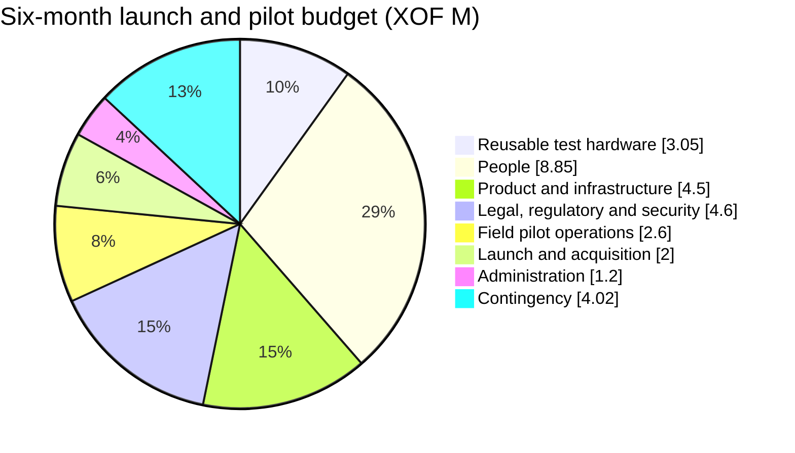
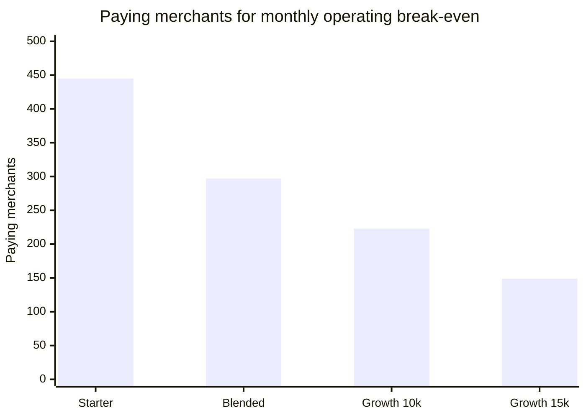
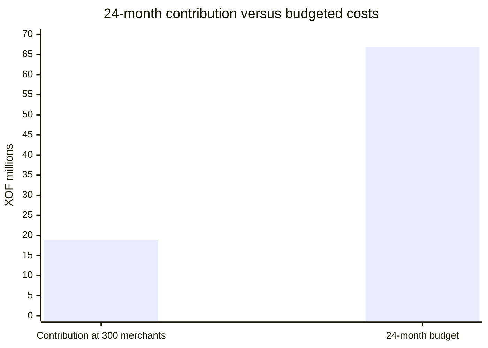

# Fidelia — Launch and Pilot Budget (Draft)

*Planning draft · 1 October 2026 · Côte d'Ivoire · XOF · [Version française](FINANCE-BUDGET.fr.md)*

Euro equivalents use the fixed peg **€1 = XOF 655.957** and are rounded to two decimals. XOF remains the operating and contracting currency; euro values are for comparison.

## Executive summary

This draft budgets a **six-month launch and pilot** in one Abidjan corridor, for **5–10 merchants**. It assumes about two months for discovery, compliance, partner setup and production readiness, followed by four months of field operation. That leaves enough time to observe at least 60 days of real merchant use. **The pilot is free for every merchant** ([CONCEPT.md § 12](CONCEPT.md#12-pilot-boundaries)); at the end, each merchant is offered the paid plan.

| Budget view | Amount |
|---|---:|
| Direct six-month costs | **XOF 26,800,000 (€40,856.34)** |
| Contingency (15%) | **XOF 4,020,000 (€6,128.45)** |
| **Total funding envelope** | **XOF 30,820,000 (€46,984.79)** |
| Rounded planning request | **XOF 30.8M (about €46,985)** |

The total includes a reusable test-device fleet and modest, part-time founder stipends. Deferring both stipends removes **XOF 6.0M (€9,146.94)** in direct costs and lowers the funding envelope to about **XOF 23.92M (€36,465.80)** after recalculating contingency. That is deferred compensation, not a zero-cost operating model. This is a six-month pilot budget, **not** the 12–18-month pre-seed amount in the investor brief.

### In brief

The XOF 30.82M (about €46,985) funds the first six months, including reusable test devices. It does not fund later growth. After the pilot, the current model assumes XOF 2M (about €3,049) in monthly fixed costs. At the assumed XOF 7,500 price, about 297 paying merchants would be needed to cover those costs. These are planning assumptions, not guaranteed results. Supplier quote tracking and the cash-flow working forecast are in the [English finance validation pack](FINANCE-VALIDATION.md) and the [French version](FINANCE-VALIDATION.fr.md).

## Scope and budget assumptions

- Phase 0 discovery and compliance, then Phase 1 merchant MVP and pilot only; no expansion beyond one corridor.
- Five to ten maquis and grocery shops (pharmacies are out of the pilot, see [CONCEPT.md § 12](CONCEPT.md#12-pilot-boundaries)); company-owned testing devices only, with no merchant hardware purchases.
- Test fleet assumes two Android phones, two iPhones, two Android tablets, two iPads, and two mid-range/refurbished laptops. Device prices are allowances, not quotes; reduce the budget if suitable devices are already available.
- Production readiness includes Tier 0 phone/OTP login, access controls, production secrets/backups, one live payment-partner integration, and Wave capture if access is approved.
- Fidelia does not hold funds, lend, underwrite, or fund merchant rewards. Customer payments continue on the merchant's existing wallet; aggregator routing is not assumed as the default.
- Budgeted amounts are **management estimates, not supplier quotes or verified Côte d'Ivoire market rates**. Confirm with local legal, security, messaging, hosting, and field-service providers before committing funds.
- Costs are shown gross in XOF. Tax treatment, VAT recoverability, company status, and any partner onboarding or minimum-volume fees require confirmation.

## Itemized six-month budget

| Cost area | Basis | XOF | EUR equivalent |
|---|---|---:|---:|
| **Reusable test hardware** |  | **3,050,000** | **4,649.70** |
| Android phones | 2 × 125,000 | 250,000 | 381.12 |
| iOS phones (iPhones) | 2 × 300,000 | 600,000 | 914.69 |
| Android tablets | 2 × 150,000 | 300,000 | 457.35 |
| iOS tablets (iPads) | 2 × 300,000 | 600,000 | 914.69 |
| Laptops | 2 × 500,000; mid-range/refurbished estimate | 1,000,000 | 1,524.49 |
| Cases, chargers, adapters and screen protection | Fleet allowance | 300,000 | 457.35 |
| **People** |  | **8,850,000** | **13,491.74** |
| Technical founder stipend | 6 months × 600,000 | 3,600,000 | 5,488.16 |
| Commercial/partnership founder stipend | 6 months × 400,000 | 2,400,000 | 3,658.78 |
| Pilot coordinator / field officer | 6 months × 350,000 | 2,100,000 | 3,201.43 |
| Part-time customer support and data QA | 3 months × 250,000 | 750,000 | 1,143.37 |
| **Product and infrastructure** |  | **4,500,000** | **6,860.21** |
| Specialist integration and production hardening | 24 days × 100,000; OTP, Wave/webhook work, access control and release readiness | 2,400,000 | 3,658.78 |
| Hosting, database, domain, backups and monitoring | 6 months × 150,000 | 900,000 | 1,372.04 |
| OTP, SMS/WhatsApp and payment test costs | Pilot-volume allowance; confirm provider rates | 600,000 | 914.69 |
| Merchant connectivity allowance | 10 outlets × 10,000 × 6 months; no merchant phone purchase | 600,000 | 914.69 |
| **Legal, regulatory and security** |  | **4,600,000** | **7,012.65** |
| Company registration and brand/legal administration | One-time allowance; remove or reduce if already completed | 800,000 | 1,219.59 |
| Regulatory, privacy and commercial counsel | Funds-flow, data/consent review, terms and partner agreement | 1,800,000 | 2,744.08 |
| Independent scoped security assessment | Production-readiness review and retest allowance | 1,500,000 | 2,286.74 |
| Payment-partner contract and onboarding support | Excludes any unquoted partner minimums | 500,000 | 762.25 |
| **Field pilot operations** |  | **2,600,000** | **3,963.67** |
| Corridor transport and field per diem | 6 months × 250,000 | 1,500,000 | 2,286.74 |
| Merchant onboarding and training | 10 outlets × 50,000 | 500,000 | 762.25 |
| Printed QR / merchant materials | One-time corridor kit | 250,000 | 381.12 |
| Merchant association meetings and field sessions | Allowance | 350,000 | 533.57 |
| **Launch and acquisition** |  | **2,000,000** | **3,048.98** |
| French/local-language launch content and creative | Allowance; prioritize French and merchant-facing materials | 500,000 | 762.25 |
| Corridor launch and customer activation | Local, targeted activity; no broad paid-media campaign | 800,000 | 1,219.59 |
| Referral / reseller commissions | Capped pilot allowance; pay only on eligible acquired merchants | 300,000 | 457.35 |
| Partner demos and outreach | Allowance | 400,000 | 609.80 |
| **Administration** |  | **1,200,000** | **1,829.39** |
| Bookkeeping and accounting | 6 months × 100,000 | 600,000 | 914.69 |
| Business communications, bank and administrative charges | Allowance | 300,000 | 457.35 |
| Essential software and productivity tools | Allowance | 300,000 | 457.35 |
| **Direct-cost subtotal** |  | **26,800,000** | **40,856.34** |
| Contingency | 15% of direct costs | 4,020,000 | 6,128.45 |
| **Total** |  | **30,820,000** | **46,984.79** |

Budget envelope by category (XOF millions, including contingency):

## What this budget does not include

- A second operator integration, PI-SPI connection, or work beyond the single-partner MVP.
- Phase 2 campaigns at scale, multi-outlet sales, tontines, scoring, savings, lending, or financial-partner commissions.
- Loan principal, customer funds, merchant payment volume, or merchant-funded rewards.
- Additional hardware beyond the reusable test fleet, including merchant phones, POS terminals, or other merchant equipment; the concept and market review caution against hardware-heavy deployment.
- Full-market salaries, founder back pay, geographic expansion, or more than six months of runway.
- Unquoted partner setup/minimum fees, major incident response, litigation, or taxes not covered by the listed allowances.

Any material payment-provider charge must be disclosed before the customer pays and must not make a merchant's payment more expensive than its existing wallet. Confirm whether a live pilot can use the merchant's own Wave account and webhook under the documented setup before treating the integration allowance as sufficient.

## Revenue treatment

The funding requirement is **gross spend**; no revenue is deducted. The pricing hypotheses are XOF 5,000/month for Starter and XOF 10,000–15,000/month for Growth, but willingness to pay and conversion are not validated. Sponsored-deal revenue is also unproven. The optional 7-day placement test at XOF 1,000–3,000 is shown only as an upside sensitivity in the [finance validation pack](FINANCE-VALIDATION.md) and its [French version](FINANCE-VALIDATION.fr.md); it does not reduce the funding request or baseline forecast. No payment share, lender referral fee, or credit-related income is included: each depends on partner terms, consent, reconciliation, and regulatory review.

**Pilot receipts are zero by design**: subscriptions and offers are free during the pilot. For scale only, if all 5–10 pilot merchants accepted the paid plan, the first four months after the pilot would bring **XOF 100,000 (€152.45) to XOF 600,000 (€914.69) gross** at the documented price hypotheses. This is an illustration, not a forecast.

## 24-month break-even model (illustrative)

This is a planning hurdle, not a forecast. The project has no validated paid conversion, churn, notification cost, or post-pilot operating history yet. Month 1 is the start of launch; month 24 is the end of the second year.

| Assumption | Base case (XOF) | EUR equivalent |
|---|---:|---:|
| Months 1–6 launch and pilot envelope, including contingency | XOF 30,820,000 | €46,984.79 |
| Months 7–24 fixed operating costs | XOF 2,000,000/month × 18 = XOF 36,000,000 | €3,048.98/month × 18 = €54,881.65 |
| Total 24-month budgeted costs | **XOF 66,820,000** | **€101,866.43** |
| Blended subscription revenue per paying merchant | XOF 7,500/month | €11.43/month |
| Contribution margin after variable servicing costs | 90% (assumption; to validate) | 90% |
| Contribution per paying merchant | **XOF 6,750/month** | **€10.29/month** |
| Pilot and partner revenue counted | XOF 0; conservative, no uncontracted revenue | €0 |

The post-pilot XOF 2.0M (€3,048.98)/month operating-cost assumption comprises founder stipends (XOF 1.0M / €1,524.49), field and customer support (XOF 500,000 / €762.25), fixed hosting/backups (XOF 150,000 / €228.67), sales and travel (XOF 200,000 / €304.90), and bookkeeping, administration and software (XOF 150,000 / €228.67). Variable servicing costs are separately reflected in the assumed 90% contribution margin.

### Monthly operating break-even

At XOF 2.0M fixed monthly costs, Fidelia needs the following active, paying merchants to cover monthly costs from subscriptions alone:

| Subscription assumption | Contribution per merchant/month (90% margin) | EUR equivalent | Paying merchants to break even |
|---|---:|---:|---:|
| Starter: XOF 5,000/month (€7.62) | XOF 4,500 | €6.86 | **445** |
| Blended: XOF 7,500/month (€11.43) | XOF 6,750 | €10.29 | **297** |
| Growth: XOF 10,000–15,000/month (€15.24–€22.87) | XOF 9,000–13,500 | €13.72–€20.58 | **223–149** |

Formula: monthly fixed costs ÷ (monthly subscription × contribution margin), rounded up. This excludes payment or lender commissions and assumes no incremental support or acquisition cost beyond the monthly budget.

### Recovery of launch costs by month 24

At the blended base case, recovering the full XOF 66.82M (€101,866.43) budget requires about **9,900 paid-subscription months**: one merchant paying for one month counts as one. Each merchant is assumed to contribute XOF 6,750 (€10.29) per month after variable service costs. Across months 7–24, that means an average of **550 paying merchants**. If the paying base grew linearly from 10 merchants in month 7, it would need to reach roughly **1,090 paying merchants in month 24** to recover the full two-year budget by then.

For comparison, a scenario that grows linearly from 10 paying merchants in month 7 to 300 in month 24 generates about **2,790 paid-subscription months** and XOF 18.8M (€28,709.96) in contribution over those 18 months. It would only just reach monthly operating break-even at month 24 (300 × XOF 6,750 = XOF 2.025M / €3,087.09 per month), while leaving roughly **XOF 48.0M (€73,156.47)** of the two-year budget unrecovered. This illustrates that covering monthly costs is not the same as recovering launch investment.

### Conditional time to break even after pilot validation

The following sensitivity answers how long break-even could take **if** the pilot validates the key assumptions. It is an alternative growth path to the straight-line-to-300 example above.

Assume the pilot ends in month 6 with 10 paying merchants; blended subscription revenue is XOF 7,500 (€11.43) per merchant/month; contribution margin is 90%; post-pilot fixed operating costs stay at XOF 2.0M (€3,048.98)/month; and the business adds 15, 25, or 35 **net** paying merchants each month from month 7 onward. “Net” means after cancellations. Pilot revenue is still excluded, and the full launch budget and contingency are treated as spent.

| Net new paying merchants/month | Monthly operating break-even | Recovery of full launch and operating costs |
|---:|---|---|
| 15 | **Month 26**, at 310 paying merchants | **Month 56**, at 760 paying merchants |
| 25 (base scenario) | **Month 18**, at 310 paying merchants | **Month 39**, at 835 paying merchants |
| 35 | **Month 15**, at 325 paying merchants | **Month 32**, at 920 paying merchants |

For the 25-net-additions case, monthly contribution first exceeds XOF 2.0M (€3,048.98) fixed costs in month 18: 310 × XOF 6,750 = XOF 2.0925M (€3,190.00). Cumulative recovery occurs in month 39: contribution is about XOF 96.90M (€147,717.38), versus XOF 30.82M (€46,984.79) launch costs plus XOF 66.0M (€100,616.35) post-pilot operating costs. Thus the conditional estimate is **18 months to monthly operating break-even, and 39 months from launch to recover the full budget** (about 33 months after the pilot period).

These dates depend on validating paid conversion and renewal at the assumed blended price, a 90% contribution margin after messaging and other variable service costs, fixed monthly costs staying within XOF 2.0M, and sustained net acquisition at the stated pace. The 25–35 net additions/month scenarios are ambitious relative to a 5–10-merchant pilot. If any assumption is missed, break-even moves later; churn, taxes, growth-related staffing, or higher customer-acquisition costs would also extend the timeline. Treat this as a scenario for planning, not an investor commitment.

The model assumes the full contingency is spent, counts no pilot receipts, and holds post-pilot costs flat as the merchant base grows. It excludes tax, churn, financing costs, and additional per-merchant acquisition or support costs, so the 24-month recovery case is optimistic and should not be presented as a commitment. Replace these assumptions with actual pilot conversion, renewal, servicing-cost, acquisition-cost and vendor data before using this for an investor forecast.

## Release and control of funds

Use three approval gates to avoid spending ahead of evidence:

1. **Readiness gate:** approve legal/regulatory scope, confirm a licensed payment partner and Wave access, agree the pilot cohort, and validate local vendor quotes. Do not expose real users or money while authentication, authorisation, backups, reconciliation, and the funds-flow review remain unresolved.
2. **Pilot gate:** release field and customer-activation spend only after the production-readiness review and written partner/merchant arrangements are in place.
3. **Continuation gate:** after 60+ days, review the share of real sales recorded, merchant activity, new customers brought by the customer app, repeat visits, the share of merchants accepting the paid plan when the free pilot ends, support cost, messaging cost, and unresolved privacy/security/regulatory issues before extending the pilot.

Track actuals monthly by category. Obtain at least two local quotes for legal/security, messaging, and field services; reconcile merchant acquisition and subscription receipts separately. Keep the contingency controlled by founder approval and do not treat it as an automatic spend target.

## Basis in project documents

Scope and gates follow [CONCEPT.md](CONCEPT.md), [BUSINESS-MODEL.md](BUSINESS-MODEL.md), [ROADMAP.md](ROADMAP.md), [PARTNERS.md](PARTNERS.md), and the pre-seed assumptions in [INVESTOR-BRIEF.md](INVESTOR-BRIEF.md). The roadmap says the project is pre-pilot, specifies 5–10 merchant interviews and a 5–10 merchant pilot, and requires 60+ days of usage; the business model labels pricing as hypotheses and excludes partner commissions until contracted. The existing deployment guide describes free services as a test environment and lists paid production hosting, backups, phone login, reconciliation, and security review as launch requirements.