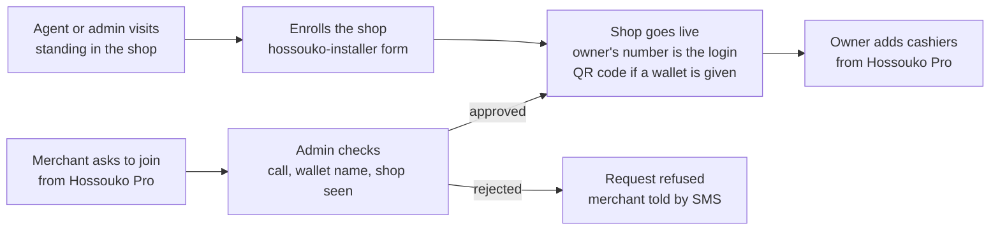

# User enrollment: customers, merchants, cashiers, field agents

As of 4 October 2026.

## Summary

Everyone signs in the same way: a phone number and a 6-digit SMS code, with no password. What differs is who may open which app.

- **Customers** need no enrollment. The first successful code in Hossouko creates the account.
- **Merchants** never create their own shop. Hossouko enrolls the shop on site, or approves a request the merchant sends from Hossouko Pro.
- **Cashiers** are shop staff invited by the owner from Hossouko Pro. They record sales and serve customers, but cannot touch money settings.
- **Field agents** are Hossouko staff who enroll shops on site from hossouko-installer. They see only the shops they enrolled.
- **Admins** grant the merchant, agent and admin roles, and review merchant requests against a 3-point checklist.

One phone number is one account. A person can hold several roles; the app they open decides which session they get.

## Roles

Five roles, each tied to one app. Only the customer role is self-service; every other role is given by someone above it.

| Role | App | Who gives it | Can do | Cannot do |
| --- | --- | --- | --- | --- |
| Customer | Hossouko | Self, on first sign-in | Find shops and pharmacies, see deals, pay, earn and spend points | Anything in Hossouko Pro or hossouko-installer |
| Merchant (owner) | Hossouko Pro | Admin or field agent, at enrollment | Everything for their one shop: sales, payments, points, deals, photos, location, Wave, statements, staff | Run a second shop from the same number |
| Cashier | Hossouko Pro | The shop owner | Record sales, request payments, show the pay QR, look up and redeem points, see deals | Wave, payouts, stats, deals, photos, location, statements, export, staff |
| Field agent | hossouko-installer | Admin | Enroll a shop on site, see the shops they enrolled | Approve requests, see other shops, users, payments or billing |
| Admin | hossouko-installer | Another admin | Everything, including granting roles and approving requests | Remove their own admin role |

The server picks the session from the person's roles (`session_role` in `backend-api/app/api/auth.py`). In Hossouko Pro, an owner gets a merchant session and a cashier gets a cashier session. In hossouko-installer, an admin gets an admin session and a field agent gets an agent session.

## Customers (Hossouko)

A customer is enrolled the moment they prove they hold a phone number. There is no form, password or email.

1. The customer types their number and taps "Recevoir le code".
2. They type the 6-digit code from the SMS. It lasts 5 minutes and allows 5 tries.
3. The first correct code creates the account. Later codes sign them back in.
4. The app may then ask for a first name. It is optional.

Points a customer earned at a shop counter before installing the app are filed under their phone number. They appear on first sign-in with nothing to claim.

Identity checks stay out of sign-up. A liveness check comes only with tontine, and a national ID only with sharing history with a lender (tiers 1 and 2 in [Concept](../business/CONCEPT.md)).

## Merchants (Hossouko Pro)

A merchant account issues payment QR codes and receives money, so a shop is always checked by Hossouko before it goes live. There are two ways in, and both end the same way: a shop record, the owner's number linked to it, and a QR code if a wallet was given.

**1. Enrolled on site.** A field agent or admin visits the shop and creates it in hossouko-installer, entering the shop details and the owner's number. Being there is the check. The shop records who enrolled it.

**2. The merchant asks to join.** From the Hossouko Pro sign-in screen, the merchant verifies their number with a code, then sends the shop name, category, commune, address and wallet. An admin reviews it in hossouko-installer and approves or rejects it. The merchant gets an SMS either way and signs in with the same number.

Only a merchant's own request passes through the admin checks; an agent's visit is the check.

Before approving a request, the admin must confirm up to three checks. The server refuses an approval with any required check missing, and stores the checks with the admin who approved (`APPROVAL_CHECKS` in `backend-api/app/api/onboarding.py`).

- **Called:** the admin phoned the number and spoke to the owner.
- **Wallet name matches:** the mobile money account holder's name matches the contact name on the request. Required only when the request names a wallet.
- **Shop seen:** a photo of the storefront, a GPS fix taken in the shop, or a visit confirms the shop exists at that address.

After approval, the owner connects their own Wave Business account from Hossouko Pro. One number runs one shop; a second shop needs a second number for now.

## Cashiers

The owner adds staff from Hossouko Pro so nobody has to borrow the owner's phone or full access. Each cashier signs in on their own phone with their own number.

1. The owner opens **Mon equipe** in the Hossouko Pro account menu, taps **Ajouter un caissier**, and enters the staff member's number and first name.
2. The staff member gets a courtesy SMS saying they can sign in to Hossouko Pro.
3. They install Hossouko Pro and sign in with their number and a code. The server gives them a cashier session for that shop.
4. Hossouko Pro hides what a cashier cannot use: Wave, deal publishing, photos, location and the team.

Rules:

- A number can be a cashier at one shop only, and cannot be a cashier at a shop it owns.
- A shop can have up to 10 active cashiers.
- Every sale keeps the number of whoever recorded it (`sale_events.recorded_by`), so the owner can tell sales apart.
- The owner can remove a cashier at any time. The cashier's next request is refused, and their sessions cannot renew.
- A cashier keeps their customer account. Their points as a customer are unaffected.

## Field agents

Field agents enroll shops in person without holding admin powers. An admin grants the role by phone number in hossouko-installer (Utilisateurs), and can take it back at any time.

- The agent signs in to hossouko-installer on their phone's browser, with their number and a code. They see two pages only: **Inscrire un commerce** and **Mes commerces**.
- Enrolling a shop is the same form admins use: shop details, the owner's number (required for agents), and the wallet if the owner has one. The shop goes live straight away, because the agent is standing in it.
- Each shop records which agent enrolled it (`venues.enrolled_by`). Admins see that in the shop list, which supports paying agents per enrollment.
- An agent cannot approve merchant requests, edit shops after enrollment, or see users, payments, billing or other agents' shops.
- Removing the agent role stops their session from renewing; an open session ends within the hour. Shops they enrolled stay live and keep their attribution.

## Lost phones and new numbers

Because the account is the phone number, recovery covers three cases. They apply to every role.

| Situation | What the person does | Who decides |
| --- | --- | --- |
| Phone lost, number kept (replacement SIM) | Signs in again with a code, then ends every other session | The person |
| New number, old SIM still at hand | Proves both numbers with two codes; the account moves at once | The person |
| Old number gone | Proves the new number and describes the account; the old number is warned by SMS | An admin |

A move carries everything the person owns to the new number: points, payments, the shop they own, the shop they work at as a cashier, and the shops an agent enrolled. Records of who did what in the past, such as who recorded a sale, stay on the old number. Every session on the old number ends (`backend-api/app/services/account_move.py`).

## Test accounts

On the test server, shared numbers sign in with the fixed code `000000`, with no SMS sent. They are set by `TEST_OTP_NUMBERS` in [`render.yaml`](../../render.yaml) and work only when `HOSSOUKO_ENV=test`; the API refuses to start with them in production.

| Number | App | Role |
| --- | --- | --- |
| 07 00 00 00 01 | Hossouko | Customer |
| 07 00 00 00 02 | Hossouko Pro | Owner of "Chez Tantie Awa (exemple)" |
| 07 00 00 00 03 | Hossouko Pro | Cashier at "Chez Tantie Awa (exemple)" |
| 07 00 00 00 04 | hossouko-installer | Field agent |

The roles come from the sample data (`HOSSOUKO_SEED_SAMPLE=1`). The admin test number, 07 00 00 00 09, is seeded too but has no fixed code: it signs in with a real code from the server log, so the public download page never opens admin access.

## API reference

All paths are under `/api`.

| Endpoint | Who | What it does |
| --- | --- | --- |
| `POST /auth/otp/request` | Anyone | Sends a sign-in code. `app` is `customer`, `merchant` or `admin` |
| `POST /auth/otp/verify` | Anyone | Exchanges the code for a session. The response's `role` is `customer`, `merchant`, `cashier`, `admin` or `agent` |
| `GET /merchant/staff` | Owner | Lists active cashiers, with whether each has signed in |
| `POST /merchant/staff` | Owner | Adds a cashier: `phone`, optional `name`. Sends a courtesy SMS |
| `DELETE /merchant/staff/{id}` | Owner | Removes a cashier and revokes their sessions |
| `POST /admin/venues` | Admin, agent | Enrolls a shop. Agents must give `merchant_phone`; the shop records `enrolled_by` |
| `GET /agent/venues` | Agent, admin | Shops the caller enrolled, newest first |
| `POST /partner-requests/code`, `POST /partner-requests` | Anyone | A merchant asks to join |
| `POST /admin/partner-requests/{id}/approve` | Admin | Approves with `checks`: `called`, `shop_seen`, and `wallet_name_matches` when a wallet is named |
| `POST /admin/users/roles` | Admin | Grants `merchant`, `agent` or `admin` |
| `POST /admin/users/roles/revoke` | Admin | Removes `merchant`, `agent` or `admin` and revokes that role's sessions |

Cashier sessions may call sales, payment requests, the pay QR, counter points, and read deals, photos and location (`SHOP_STAFF` in `backend-api/app/core/security.py`). Every other `/merchant/*` route answers 403 to a cashier. Migration `0022_enrollment_roles` adds the `venue_staff` table, `venues.enrolled_by` and `partner_requests.review_checks`. Tests: `backend-api/tests/test_enrollment_roles.py`.

## Open questions

- **Agent pay:** is a field agent paid per shop enrolled, per active shop after 30 days, or not per shop at all? The attribution is recorded either way.
- **Agent edits:** should agents correct a shop they enrolled (hours, address) in its first week, or always ask an admin?
- **Cashier view of totals:** cashiers see the sales recorded on their own phone, not the shop's revenue. Confirm owners want it that way.
- **Several shops per owner:** one number runs one shop today. A shop picker in Hossouko Pro is needed if chains or multi-shop owners join.
- **Agent-enrolled shops and the checklist:** agents skip the 3-point checklist because they stand in the shop. Decide whether they should still record a storefront photo.
